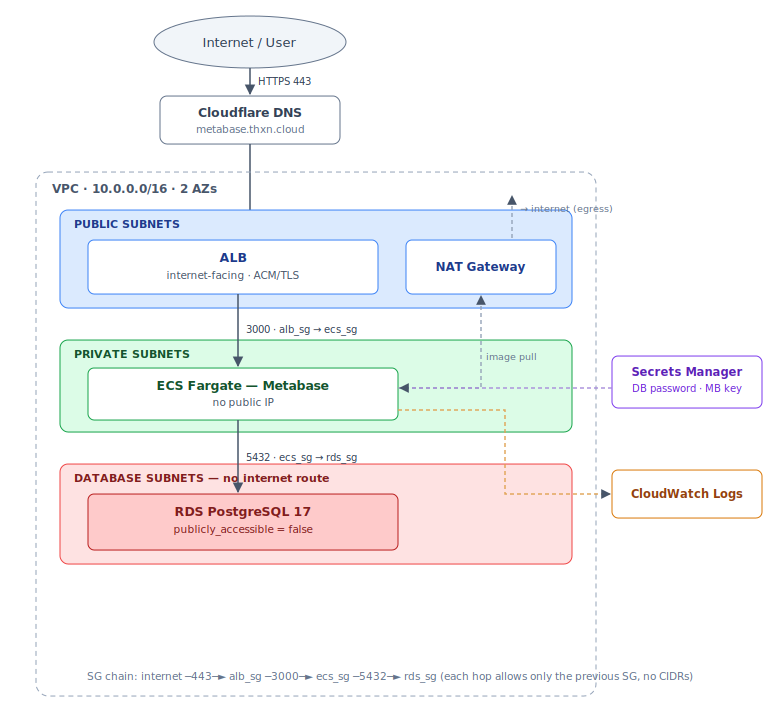

# coraline-metabase

Terraform: **Metabase** public over HTTPS, its **PostgreSQL** private (reachable only
by Metabase). Live: **https://metabase.thxn.cloud**

## Contents

- [Architecture](#architecture)
- [Layout](#layout)
- [Setup](#setup)
- [Test](#test)

## Architecture

One VPC (`10.0.0.0/16`, 2 AZs), three subnet tiers:



<sub>Diagram source: [`docs/architecture.mmd`](docs/architecture.mmd) (Mermaid).</sub>

SG chain `internet ─443─► alb_sg ─3000─► ecs_sg ─5432─► rds_sg` (each hop allows only
the previous SG, no CIDRs). So the DB is unreachable from the internet; the ALB is the
only public entry. Secrets Manager holds the DB password + Metabase key; logs go to
CloudWatch.

## Layout

One file per service/concern, number-prefixed to read top-to-bottom in infra order
(Terraform loads every `.tf` regardless — the numbers are for humans):

| File | Creates |
|------|---------|
| `0_config` | provider settings + **S3 backend** |
| `1_network` | VPC, public/private/database subnets (2 AZ), IGW, NAT |
| `2_security` | `ecs_sg`, `rds_sg` |
| `3_secrets` | DB password + Metabase key → Secrets Manager |
| `4_rds` | private PostgreSQL 17 |
| `5_iam` | ECS execution + task roles |
| `6_logs` | CloudWatch log group |
| `7_acm` | ACM cert + validation |
| `8_alb` | ALB, target group, 80→443, 443 listener |
| `9_ecs` | cluster, task definition, service |
| `10_outputs` | url, ALB DNS, validation records, RDS endpoint |

**State** is stored securely in S3 (`coraline-metabase-tfstate`): versioned,
KMS-encrypted, public-access-blocked, native locking — no local `.tfstate`.

## Setup

Add AWS creds to `~/.aws/credentials` (profile must match `aws_profile` + the backend
in `0_config.tf`):

```ini
[coraline-iac]
aws_access_key_id     = ...
aws_secret_access_key = ...
```

DNS is managed in **Cloudflare** on my own domain **`thxn.cloud`** (records added as
DNS-only / grey-cloud). Set `domain_name` in `terraform.tfvars`, then — staged,
because the ACM cert validates through external DNS:

```bash
terraform init
terraform apply -target=aws_acm_certificate.metabase   # then add printed CNAME in DNS
terraform plan                                         # review before the full build
terraform apply                                         
terraform output -raw alb_dns_name                     # then CNAME your domain -> this value
```

Each step prints a value that I add as a **Cloudflare CNAME** (DNS-only / grey-cloud):

- **`acm_validation_records`** — the validation CNAME; lets ACM issue the certificate.
- **`alb_dns_name`** — the target for the `metabase.thxn.cloud` record, which publishes
  Metabase at **https://metabase.thxn.cloud**.

Destroy: `terraform destroy`.

## Test

### Anyone can verify — no AWS credentials

**1. Site is public over HTTPS** — open <https://metabase.thxn.cloud> (Metabase
login / setup page).

**2. Health check:**

```bash
curl -sSf https://metabase.thxn.cloud/api/health   # {"status":"ok"}
```

**3. DB is private — by design in the code:** `4_rds.tf` (`publicly_accessible = false`,
database subnets), `2_security.tf` (5432 only from the ECS SG), and `1_network.tf`
(database subnets have no route to the Internet Gateway). Nothing outside the VPC can
reach it.

### Owner confirmation — needs account access

```bash
# config: RDS is not public
aws rds describe-db-instances --db-instance-identifier coraline-metabase \
  --profile coraline-iac --region ap-southeast-1 \
  --query 'DBInstances[0].PubliclyAccessible'          # false

# network: a direct connection times out
psql -h "$(terraform output -raw rds_endpoint | cut -d: -f1)" -U metabase metabase  # times out
```
